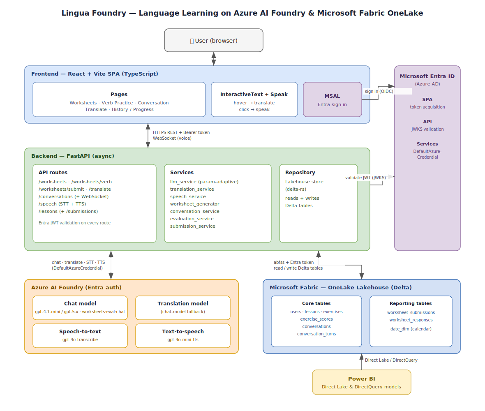

# Language Learning App

AI-powered language learning platform that showcases **Azure AI Foundry** models
(chat, translation and speech) with all data stored in **Microsoft Fabric OneLake**.
Supports **French**, **Spanish** and **English**.

Generate scenario worksheets, drill individual verbs, translate text, and practice
real conversations by voice or text. Everything is secured with **Microsoft Entra ID**.

## Features

- **Scenario worksheets** — vocabulary, grammar notes and auto-graded exercises for any
  real-life situation, optionally focused on a specific tense.
- **Verb practice** — pick a verb (or type your own) and get a worksheet centred on its
  conjugations, two-way translations, and use in real sentences and conversations.
- **Translate** — powered by a dedicated Azure AI Foundry translation deployment
  (falls back to the chat model when none is configured); speak the source text and each
  translation aloud.
- **Conversation practice** — chat with an AI tutor by text or microphone; speech is
  transcribed with a Foundry speech-to-text model and the tutor's replies are spoken back
  so you hear the pronunciation.
- **Interactive words everywhere** — hover any target-language word for an instant English
  tooltip, or click it to hear it pronounced (Foundry text-to-speech).
- **Submit & track progress** — submit a finished worksheet to persist a denormalized
  record (questions, answers, first vs corrected scores, attempts) to OneLake, then review
  it under **History → Progress**. Ready for Power BI reporting.
- **History** — every worksheet, conversation and submission is persisted to OneLake and
  browsable per user.
- **Current-events conversations (Real-Time Intelligence)** — stream real news (GDELT) into
  a Fabric **Eventhouse**, enrich it with Foundry (translate → ES/FR, summarize, CEFR-grade,
  tag verbs/tenses/topics, embed), then practise a conversation grounded in a fresh, real
  headline. Runs fully offline in dev (`RTI_BACKEND=local`).

## Architecture



> Editable source: [`docs/architecture.drawio`](docs/architecture.drawio) (open in
> [draw.io](https://www.drawio.com/)). Built with the
> [drawio-skill](https://github.com/Agents365-ai/drawio-skill) using the official
> **Microsoft Fabric** icons ([@fabric-msft/svg-icons](https://github.com/FabricTools/fabric-icons))
> for OneLake, Real-Time Intelligence / Eventhouse and Power BI, and the **Azure Architecture
> Center** icons for the Azure services. The presentation/application tiers show a recommended
> Azure hosting topology (Static Web Apps + App Service); the app code itself is a plain React
> SPA + FastAPI and can run anywhere. Monitoring and security services are the recommended
> platform components for a production deployment.

| Layer | Technology |
|-------|------------|
| Frontend | React + Vite + TypeScript, MSAL (Entra ID) — e.g. Azure Static Web Apps |
| Backend | FastAPI (async), Entra JWT validation — e.g. Azure App Service |
| Data | **Microsoft Fabric OneLake Lakehouse** — Delta tables via `deltalake` |
| Real-Time Intelligence | **Microsoft Fabric Eventhouse** (KQL DB) — enriched news stream, OneLake-available |
| AI | Azure AI Foundry: chat (`gpt-4.1-mini`/`gpt-5.x`), translation, STT (`gpt-4o-transcribe`), TTS (`gpt-4o-mini-tts`), embeddings |
| Reporting | Power BI on OneLake — Direct Lake and DirectQuery semantic models |
| Security | Microsoft Entra ID (app registrations), Managed Identity, Key Vault, Microsoft Defender for Cloud |
| Monitoring | Azure Monitor, Application Insights, Log Analytics |
| Auth | Microsoft Entra ID end-to-end (`DefaultAzureCredential` for services, bearer tokens for the API) |

The data layer is **config-driven**: the same Delta-table code writes to a local
directory in development (`STORAGE_BACKEND=local`) or to a Fabric Lakehouse over
`abfss` in production (`STORAGE_BACKEND=onelake`), authenticated with Entra ID. The
LLM client adapts its parameters per deployment, so both older (`gpt-4.1-mini`,
`max_tokens`) and newer (`gpt-5.x`, `max_completion_tokens`, default temperature) models
work unchanged.

## Prerequisites

- **Node.js** 18+ and **Python** 3.11+
- **Azure CLI** (`az login`) — Entra auth for all Azure services
- An **Azure OpenAI** / **AI Foundry** resource with the deployments below
- (Production) A **Fabric workspace + Lakehouse**, and Entra **app registrations**

## Model deployments

Deploy these in Azure AI Foundry / Azure OpenAI and put the deployment names in `.env`:

| Purpose | Recommended model | Setting |
|---------|-------------------|---------|
| Chat + evaluation + worksheets | `gpt-4.1-mini` (or `gpt-4o-mini`) | `AZURE_OPENAI_DEPLOYMENT` |
| Speech-to-text | `gpt-4o-transcribe` (or `gpt-4o-mini-transcribe`) | `AZURE_SPEECH_TO_TEXT_MODEL_NAME` |
| Text-to-speech | `gpt-4o-mini-tts` | `AZURE_TEXT_TO_SPEECH_MODEL_NAME` |
| Translation (optional, dedicated) | a chat model such as `gpt-4o-mini` | `AZURE_TRANSLATION_MODEL_NAME` |
| Embeddings (optional, for news semantic retrieval) | `text-embedding-3-small` | `AZURE_OPENAI_EMBEDDING_DEPLOYMENT` |

> **Note:** the previous build pointed STT at `gpt-4o-transcribe-diarize`, which is not a
> standard transcription deployment — switch it to `gpt-4o-transcribe`. If you don't have a
> separate translation deployment, leave `AZURE_TRANSLATION_MODEL_NAME` empty and the chat
> model is used.

## Quick start

### 1. Backend

> **Windows on ARM (important):** create the venv with an **x64 Python 3.11**, not the
> ARM64 build. `deltalake` (and some other native wheels) ship prebuilt **win_amd64**
> wheels but **not win_arm64**, so an ARM64 interpreter tries to compile from source and
> fails. Use the launcher to pick the x64 3.11 explicitly: `py -3.11`. Check your venv with
> `python -c "import platform; print(platform.machine())"` → it should print `AMD64`.

```bash
cd backend
py -3.11 -m venv venv            # Windows: x64 Python 3.11 (or: python3.11 -m venv venv)
venv\Scripts\activate            # Windows (or: source venv/bin/activate)
pip install -r requirements.txt
copy .env.example .env           # edit with your endpoints
az login                         # Entra auth for Azure services
uvicorn app.main:app --reload --port 8000
```

By default `STORAGE_BACKEND=local` writes Delta tables under `backend/.lakehouse/`,
and `ENTRA_AUTH_ENABLED=false` bypasses sign-in — so the app runs immediately.
API docs: http://localhost:8000/docs

### 2. Frontend

```bash
cd frontend
npm install
copy .env.example .env           # optional; defaults work for local dev
npm run dev
```

Open http://localhost:5173

### Configuration & secrets

- Copy each `.env.example` to `.env` and fill in your own values. **Only the
  `.env.example` templates are tracked** — real `.env` files are gitignored and
  must never be committed.
- **No API keys are required to run the app.** Services authenticate to Azure
  with Microsoft Entra ID via `DefaultAzureCredential` (your `az login` locally,
  a managed identity when hosted).
- The starter Power BI project
  (`fabric/pbip/LinguaFoundry.SemanticModel/definition/expressions.tmdl`) embeds
  the Fabric **workspace + lakehouse GUIDs** it was authored against. These are
  resource identifiers, not credentials, but if you clone into your own workspace
  update them (see [Starter Power BI report](#starter-power-bi-report-pbip)).

## Two layers of authentication

It's worth being precise about what "Entra auth for everything" means here, because
there are **two independent layers**:

1. **Service → Azure (always on).** The backend authenticates to Azure OpenAI, Foundry
   and OneLake with Microsoft Entra via `DefaultAzureCredential` — your `az login`
   locally, or a managed identity when hosted. **No API keys, no app registration.**
   This alone is enough to run the whole app.
2. **User → API (optional).** Making *browser users* sign in to the API (so data is
   per-user and the endpoints aren't open). This is the only part that needs an app
   registration, and it's **off by default** — you don't need it for your own use,
   because a `cognitiveservices.azure.com` token from `az login` is not valid for your
   own API. Enable it only when hosting for multiple users (see below).

## Enabling user sign-in (Microsoft Entra ID)

The app is fully wired for layer 2 and runs unauthenticated only when the flags below are off.

**Backend** (`backend/.env`):

```env
ENTRA_AUTH_ENABLED=true
ENTRA_TENANT_ID=<tenant-id>
ENTRA_API_AUDIENCE=api://<api-client-id>
```

**Frontend** (`frontend/.env`):

```env
VITE_AUTH_ENABLED=true
VITE_ENTRA_CLIENT_ID=<spa-app-client-id>
VITE_ENTRA_TENANT_ID=<tenant-id>
VITE_ENTRA_API_SCOPE=api://<api-client-id>/access_as_user
```

Register two Entra applications: an **API** app (exposes the `access_as_user` scope) and a
**SPA** app (redirect URI `http://localhost:5173`, with delegated permission to the API
scope). The backend validates the bearer token's signature, issuer and audience against the
tenant JWKS; the WebSocket accepts the token as a `?token=` query parameter.

## Targeting Fabric OneLake

```env
STORAGE_BACKEND=onelake
ONELAKE_WORKSPACE=<workspace-name-or-guid>
ONELAKE_LAKEHOUSE=<lakehouse-name-or-guid>
```

The signed-in identity (via `DefaultAzureCredential`) needs **Contributor** on the Fabric
workspace. Tables are created lazily as Delta tables under the Lakehouse `Tables/` area:
`users`, `lessons`, `exercises`, `exercise_scores`, `conversations`, `conversation_turns`,
plus the submission + reporting tables below. Names *or* GUIDs work — GUIDs are used bare
(no `.Lakehouse` suffix); friendly names get the suffix automatically.

> Tip: with `STORAGE_BACKEND=local` nothing reaches Fabric — that's the dev default. Switch
> to `onelake` to see data in your Lakehouse.

## Real-Time Intelligence: current-events conversations

Practise a conversation about **today's news**, in the target language and at your level.
Real headlines are streamed from **GDELT**, enriched by Foundry into learner-ready study
material, stored in a Fabric **Eventhouse** (KQL database), and used to *ground* a
conversation so the tutor talks about something that actually happened today.

```
GDELT ─▶ news_ingestion ─▶ Foundry enrich ─────▶ RTI store ──▶ news_service ──▶ conversation
(poller/script)            (translate · summarize  (local JSON |   (recency +      (RAG grounding)
                            · CEFR · tag · embed)   Eventhouse)     level + vector)
```

Like the data layer, the RTI store is **config-driven** and runs with **no Fabric** in dev:

| `RTI_BACKEND` | Where enriched news lives | Vector search |
|---------------|---------------------------|---------------|
| `local` (default) | JSON under `LOCAL_RTI_PATH` (`./.rti`) | numpy cosine |
| `eventhouse` | Fabric Eventhouse KQL table | `series_cosine_similarity` in KQL |

Enrichment **degrades gracefully**: if the chat model is unavailable a minimal record is
built from the headline, and if `AZURE_OPENAI_EMBEDDING_DEPLOYMENT` is empty retrieval falls
back to recency + level (no vectors). So the whole loop works offline with the bundled
`sample` source.

### Ingesting news

Run these from the `backend/` folder **with the venv activated** (the x64 venv from
Quick start — `deltalake` needs it), so `backend/.env` is loaded:

```bash
cd backend
venv\Scripts\activate            # Windows (or: source venv/bin/activate)

# Offline: enrich bundled sample headlines (no network, no Fabric) — great for a first run
python ..\scripts\ingest_news.py --source sample

# On demand: generate fresh, unique articles every run (no GDELT rate limits)
python ..\scripts\ingest_news.py --source synthetic --languages es fr --count 12

# Live: pull fresh headlines from GDELT for the configured languages
python ..\scripts\ingest_news.py --source gdelt --languages es fr
```

> **Wrong-directory error?** `python ../scripts/ingest_news.py` only resolves from inside
> `backend/`. From the repo root, drop the `..` (`python scripts\ingest_news.py …`). Either
> way you must use the project venv — a system/ARM64 Python will fail to import `deltalake`.
> The scripts load `backend/.env` automatically regardless of the working directory.

> GDELT is free and rate-limited (~1 request / 5s per IP); the runner paces requests between
> languages. Enriched records are deduped by a stable `news_id` derived from the article URL.
> If GDELT is cooling down, use `--source synthetic` to populate the store instantly.

Or let the API poll on a timer (uses the same ingestion path):

```env
NEWS_POLL_ENABLED=true
NEWS_POLL_INTERVAL_MINUTES=60
```

### Configuration

```env
# Store backend
RTI_BACKEND=local                 # local | eventhouse
LOCAL_RTI_PATH=./.rti

# Fabric Eventhouse (only when RTI_BACKEND=eventhouse) — URIs from the Eventhouse "Cluster URI"
EVENTHOUSE_QUERY_URI=https://<cluster>.kusto.fabric.microsoft.com
EVENTHOUSE_INGEST_URI=https://<cluster>.kusto.fabric.microsoft.com
EVENTHOUSE_DATABASE=<kql-database-name>
EVENTHOUSE_NEWS_TABLE=news_enriched

# GDELT source + grading
NEWS_LANGUAGES=["es","fr"]        # JSON array (pydantic-settings)
GDELT_TIMESPAN=1d
GDELT_MAX_RECORDS=40
NEWS_DEFAULT_LEVEL=B1
NEWS_MAX_AGE_HOURS=48

# Embeddings (optional) — enables semantic retrieval
AZURE_OPENAI_EMBEDDING_DEPLOYMENT=text-embedding-3-small
```

### Eventhouse setup (production)

1. In your Fabric workspace create an **Eventhouse**; note its **Cluster URI** and the KQL
   **database** name. The signed-in identity (`DefaultAzureCredential`) needs ingest + query
   rights on the database.
2. Create the news table (the exact KQL is generated by
   `eventhouse.eventhouse_table_ddl("news_enriched")`):

   ```kql
   .create table ['news_enriched'] (news_id:string, url:string, domain:string,
     language:string, source_country:string, title_original:string,
     title_translated:string, summary:string, english_gloss:string, cefr_level:string,
     topic_tags:dynamic, verbs:dynamic, tenses:dynamic, conversation_starters:dynamic,
     vocabulary:dynamic, embedding:dynamic, seen_at:datetime, ingested_at:datetime)
   ```

3. Turn **OneLake availability ON** for the Eventhouse so the news table is mirrored to
   OneLake as Delta — this is what lets a later **ontology** join *hot* news with the *warm*
   Lakehouse learner history (`worksheet_submissions`, `conversations`).
4. Set `RTI_BACKEND=eventhouse` + the `EVENTHOUSE_*` vars and ingest.

> **Eventstream (productionization):** the script/poller above is the simplest streaming loop.
> To move to true real-time, point a Fabric **Eventstream** at a live source and land it in
> the same Eventhouse; the enrichment + retrieval code is unchanged.

> Verified offline (local store + `sample` source). The live Eventhouse and live enrichment
> paths are best-effort here — they require a Fabric cluster and a reachable Azure OpenAI
> deployment.


## Submitting worksheets & Power BI reporting

Finish a worksheet, check your answers (each **Check** records a first score; re-checking a
corrected answer records the new score), then click **Submit worksheet**. This writes a
denormalized record to OneLake as Delta tables, ready for Power BI:

| Table | Grain | Key columns |
|-------|-------|-------------|
| `worksheet_submissions` | one row per submitted worksheet | `submission_id`, `lesson_id`, `user_id`, `target_language`, `mode`, `verb`, `difficulty`, `grammar_focus`, `total_exercises`, `answered_count`, `first_correct_count`, `final_correct_count`, `first_score_avg`, `final_score_avg`, `submitted_at`, `date_key` |
| `worksheet_responses` | one row per exercise in a submission | `response_id`, `submission_id`, `exercise_id`, `question`, `correct_answer`, `user_answer`, `first_score`, `first_is_correct`, `final_score`, `final_is_correct`, `attempts`, `feedback`, `exercise_type`, `target_language`, `difficulty`, `date_key` |
| `date_dim` | one row per calendar day | `date_key` (yyyymmdd), `date`, `year`, `quarter`, `month`, `month_name`, `month_year`, `day`, `day_of_week`, `day_name`, `week_of_year`, `is_weekend` |

The **first score** vs **final (corrected) score** lets you measure improvement after
correction; `attempts` shows how many tries each exercise took.

### Modeling: Direct Lake vs DirectQuery

The same Delta tables support both storage modes, so you can build two semantic models to
compare them:

- **Direct Lake** — create a semantic model directly on the Lakehouse tables. Power BI reads
  the Delta/Parquet files in OneLake with no import and no query translation (fastest;
  refresh-free). Relate `worksheet_responses[date_key]` and `worksheet_submissions[date_key]`
  to `date_dim[date_key]`.
- **DirectQuery** — connect to the Lakehouse **SQL analytics endpoint** and build the model
  in DirectQuery mode. Each visual issues T-SQL to the endpoint at query time. Use the same
  relationships; this is the apples-to-apples comparison to Direct Lake.

Suggested model: `date_dim` (1→*) `worksheet_submissions` (1→*) `worksheet_responses`, with
`date_dim` marked as the date table. Example measures: first-try accuracy
(`final_correct_count / answered_count`), improvement (`final_score_avg - first_score_avg`),
and area-of-improvement breakdowns by `exercise_type`, `grammar_focus` or `verb`.

## Medallion analytics (Silver → Gold) + sample data

The app writes operational Delta tables to the **`dbo`** schema of the Fabric
Lakehouse (the **Bronze** layer). For reporting that combines learner activity
with the **Eventhouse** news (RTI), two PySpark notebooks build a medallion:

```
Bronze (dbo: app tables + Eventhouse news)
   └─▶ fabric/01_silver_conform.ipynb   → LH_LanguageApp_Silver
        • types timestamps + date keys, standardizes language / CEFR
        • de-dupes news, explodes dynamic arrays (topic_tags, verbs, vocabulary)
          into tidy bridge tables, drops the embedding from the reporting copy
   └─▶ fabric/02_gold_star.ipynb        → LH_LanguageApp_Gold (Direct Lake star)
        • dims: dim_user, dim_date, dim_language, dim_cefr, dim_scenario, dim_news
        • facts: fact_submission, fact_response, fact_exercise_score,
                 fact_conversation, fact_news_engagement
```

The `conversations` table carries a nullable **`news_id`** so news-grounded chats
join cleanly to `dim_news` — that's the hot-news ↔ warm-learner bridge. To wire the
Eventhouse into Silver, create a **OneLake shortcut** to its `news_enriched` table
in the Silver lakehouse (or set `news_onelake_path` / `eventhouse_query_uri` in the
notebook parameters). Schedule **Silver → Gold** via a Fabric pipeline after news
ingestion; both notebooks are idempotent (overwrite). The final Power BI relationships
and example measures are documented in the Gold notebook's closing cell.

> All three lakehouses are **schema-enabled** (`dbo`), so the notebooks read/write under
> `Tables/dbo/…`. The Silver and Gold lakehouse names + `dbo` schema in the parameter cells
> are all the notebooks need — **you do not have to "attach" lakehouses** to the notebooks,
> because every read/write uses a fully-qualified OneLake `abfss://` path. (Attaching only
> adds the Lakehouse explorer and lets you use relative `Tables/` paths or `spark.sql`.) The
> one value that must be exact is the `workspace` parameter — its name or GUID.

### Starter Power BI report (PBIP)

`fabric/pbip/LinguaFoundry.pbip` is a ready-to-open **Power BI Project** (TMDL, git-friendly)
with a **Direct Lake** semantic model over `LH_LanguageApp_Gold` — 11 tables, 18 relationships,
and 20 measures (submissions, accuracy/improvement, conversations, **News-Grounded %**, etc.).
It was authored with the Fabric **`semantic-model-authoring`** skill (from the
[skills-for-fabric](https://github.com/microsoft/skills-for-fabric) Copilot plugin).

To use it:

1. Run the Silver + Gold notebooks first so `LH_LanguageApp_Gold` has data.
2. Open `fabric/pbip/LinguaFoundry.pbip` in **Power BI Desktop** (Preview: enable *Power BI
   Project (.pbip)* files). The model binds to the Gold lakehouse via a Direct Lake named
   expression (`expressions.tmdl`) using the workspace + lakehouse GUIDs.
3. On first open, confirm the OneLake connection if prompted, then build visuals on the blank
   **Overview** page and publish to the **Language App** workspace.

> The Direct Lake expression points at the workspace/lakehouse GUIDs resolved for this repo
> (`Language App` / `LH_LanguageApp_Gold`). If you clone into a different workspace, update the
> two GUIDs in `LinguaFoundry.SemanticModel/definition/expressions.tmdl`.

### Sample data

Populate every table with realistic, report-ready data (50 `Sample User N`,
1k–5k rows per fact table, timestamps spread over the past month). Run from
`backend/` with the venv activated (same x64 venv as above):

```bash
cd backend
venv\Scripts\activate
python ..\scripts\seed_sample_data.py --dry-run   # validate against schemas, no writes
python ..\scripts\seed_sample_data.py             # seed the configured backend (dbo)
```

It writes **through the app's own data layer**, so rows always match the
authoritative schema and land in the configured `ONELAKE_SCHEMA` (`dbo`). Sample
users use the GUID prefix `5a3b1e00…` — remove them anytime with
`… where user_id LIKE '5a3b1e00%'`. A companion migration adds + backfills the
conversation `news_id` column on an existing lakehouse:
`python ..\scripts\migrate_add_conversation_news_id.py`.

## API endpoints

| Method | Endpoint | Description |
|--------|----------|-------------|
| `POST` | `/api/worksheets` | Generate a scenario worksheet |
| `POST` | `/api/worksheets/verb` | Generate a verb-focused worksheet |
| `GET`  | `/api/worksheets/verbs` | Curated verb list for the picker |
| `POST` | `/api/worksheets/evaluate` | Score an exercise answer |
| `POST` | `/api/worksheets/submit` | Submit a completed worksheet to OneLake |
| `POST` | `/api/translate` | Translate text (Foundry translation model) |
| `POST` | `/api/conversations` | Start a conversation (optionally grounded in a news article via `news_id`) |
| `POST` | `/api/conversations/{id}/message` | Send a message |
| `WS`   | `/api/conversations/{id}/ws` | Voice/text streaming |
| `POST` | `/api/speech/transcribe` | Speech-to-text |
| `POST` | `/api/speech/tts` | Text-to-speech (word & sentence pronunciation) |
| `GET`  | `/api/news/topics` | Current-events headlines by language/level (`?lang=es&level=B1&personalized=true`) |
| `GET`  | `/api/news/{news_id}` | One enriched news article |
| `GET`  | `/api/lessons` | List saved worksheets |
| `GET`  | `/api/lessons/conversations` | List conversations |
| `GET`  | `/api/lessons/submissions` | List worksheet submissions (progress) |
| `GET`  | `/api/lessons/submissions/{id}` | Submission detail with response rows |

## Project structure

```
backend/app/
├── api/           # Route handlers (Entra-protected)
├── auth/          # Entra ID JWT validation
├── services/      # LLM, translation, speech, worksheet, conversation, submission, news (RTI) logic
├── repository/    # Fabric OneLake Lakehouse (Delta) data layer + entity store; Eventhouse (RTI) store
├── models/        # Pydantic schemas
└── config.py
scripts/
├── ingest_news.py        # GDELT → Foundry enrich → RTI store (--source sample|synthetic|gdelt)
├── seed_sample_data.py   # Realistic sample data into the Lakehouse (dbo)
└── migrate_add_conversation_news_id.py   # Add + backfill conversations.news_id
frontend/src/
├── pages/         # Scenario, Verb practice, Conversation, Translate, History (+Progress)
├── components/    # Layout, reusable UI, worksheet renderer, InteractiveText, SpeakButton
├── auth/          # MSAL config, provider, token acquisition
├── services/      # API + WebSocket clients
└── state/
fabric/
├── 01_silver_conform.ipynb   # Bronze → Silver (conform app + Eventhouse news)
├── 02_gold_star.ipynb        # Silver → Gold (Direct Lake dims + facts)
└── pbip/                     # Starter Power BI Project (Direct Lake on Gold)
    └── LinguaFoundry.pbip    #   open in Power BI Desktop; semantic model + report
docs/
├── architecture.drawio   # Editable architecture diagram (draw.io, Fabric + Azure icons)
└── architecture.svg      # Rendered diagram (self-contained, embedded in this README)
```

## License

Educational purposes.
